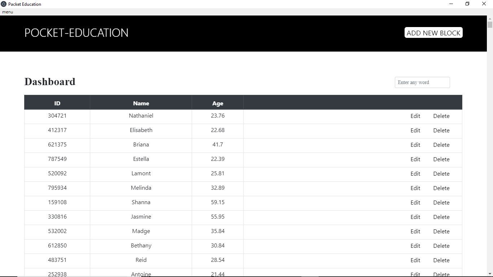
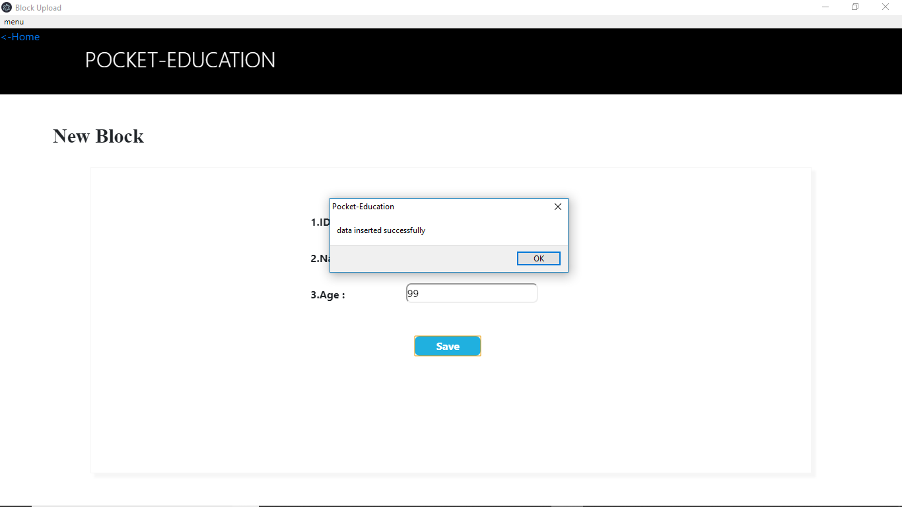
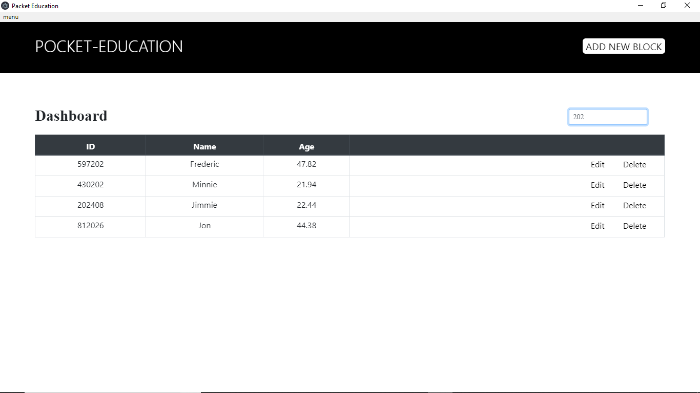
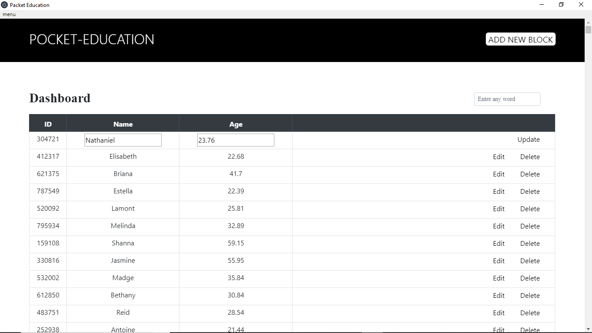
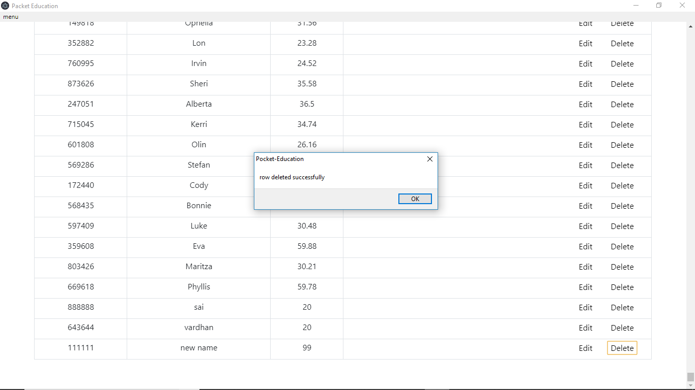

# Pocket-Education(Electronjs Application)

## To-Do :

1. It must purely done using HTML, CSS, JAVASCRIPT.
2. Data must be saved into csv file.
3. Whenever app is open again, the data must display by retrieving data from that csv file.
4. we can easily edit the data.
5. search must be based on id.  

## Solution :

Solution for this task is an electronJS application with all features needed.

### 1. display the retrieving data from csv file :

### 2. saving the data into csv file :

### 3. searching the data based on column element :

### 4. updating in csv file :

### 5. deleting data from csv file :

